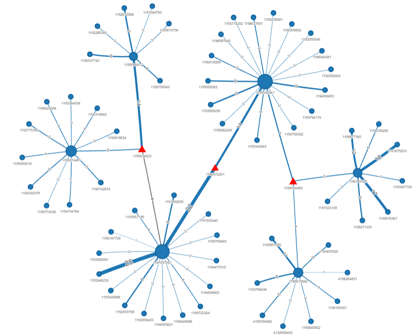

# Overview

Forensic link analysis tool that finds hidden numbers bridging separate call networks, using graph theory and statistical testing.

Link analysis is a real technique investigators use. It looks at who talks to who, and finds hidden connections between people.

My tool takes any call record file — any dataset, not just one specific file — and does three things automatically.

- First, it builds a graph. Each phone number is a node. Each call is a connection.
- Second, it finds separate networks inside that graph, on its own. No manual work needed.
- Third, it looks for numbers that connect two or more networks together. I call these "bridge" numbers. They are the hidden link between groups that look separate at first.

For each bridge number, the tool also checks something extra: does this number call people faster right after switching to a new contact? That pattern can be a sign of passing messages between groups.


[Software Demo Video](https://youtu.be/PqwRHmwR9E4) 

## How it works

1. Builds a call graph from the CDR (numbers = nodes, calls = edges, weighted by call count between each pair).
2. Runs community detection (Louvain) to automatically discover separate call networks — no need to manually identify "hub" numbers first.
3. Flags **bridges**: numbers that are graph articulation points (removing them would split the network) *and* whose contacts are mostly outside their own community. Hubs are also articulation points, but their contacts stay mostly within their own community, so that same-community percentage is what separates the two. The cutoff isn't fixed — it's set per dataset at the largest gap between consecutive same-community percentages. A warning appears in the report if that gap is under 20 percentage points, meaning the split was weak for this dataset. Results are ranked by betweenness centrality.
4. For each bridge, runs a Wilcoxon rank-sum test comparing the time gap before a call to the *same* contact vs. before *switching* to a different contact. A short switch-gap relative to same-contact-gap is a signature of relaying (receive, then immediately forward).
5. Writes an interactive network visualization to `network.html` — bridges shown as red triangles, everything else uniform, hover for community detail. Open it in any browser; drag, zoom, and click a node to see its details.
6. Writes `report.html` — a summary page with community/bridge counts, the ranked bridge table (with chaining test results and interpretation), and the calibration warning if the split was weak.

# Development Environment

I used [Positron](https://positron.posit.co/), an IDE built on the same core as VS Code with R support, running R 4.6.1 on Windows.

Libraries used:
- **igraph** — graph construction, Louvain community detection, articulation point (cut vertex) detection, and betweenness centrality
- **visNetwork** — interactive HTML network visualization (drag, zoom, hover, click-to-highlight)
- **dplyr** — data wrangling and `case_when` bucketing of results into readable categories
- **htmltools** — building the HTML summary report

## Input format

The CSV must have these columns (any extra columns are ignored):

| column      | meaning                              | format                |
|-------------|---------------------------------------|------------------------|
| `from`      | originating number                    | numeric                |
| `to`        | receiving number                      | numeric                |
| `timestamp` | when the call happened                | `YYYY-MM-DD HH:MM:SS`  |
| `duration`  | call length in seconds                | numeric                |

Example:

```csv
from,to,timestamp,duration
1195646235,1187037061,2012-05-01 08:11:00,22
1195646235,1187037061,2012-05-01 09:03:00,190
```

If your carrier export uses different column names, a different date format, or a different encoding, rename/reformat it to match before running the tool — this keeps the loader simple and predictable rather than guessing at carrier-specific quirks.

## Running it

- Clone the repository.
- Install dependencies (see below).
- Place your CDR export in the project folder, or edit the `csv_path` variable at the top of `main.R` to point at it.
- Run:
  ```
  Rscript main.R
  ```
- As it runs, a summary (community sizes, bridge list, chaining test results, and any calibration warning) is also printed to the console — useful for a quick look without opening the HTML files.
- Open `report.html` for the findings and `network.html` for the interactive graph.

### Dependencies

```r
install.packages(c("igraph", "visNetwork", "dplyr", "htmltools"))
```

## Output

- `report.html`: summary of numbers/communities/bridges found, the ranked bridge table (% calls within own community, betweenness, median gap when calling the same contact vs. switching, and the test's p-value — a low p-value means the difference is unlikely to be chance), and a warning if the bridge/non-bridge split was weak for this dataset.
- `network.html` (plus a sibling `network_files/` folder it depends on — keep them together): interactive visualization of the call network, linked from `report.html`.

# Useful Websites

- [The R Project for Statistical Computing](https://www.r-project.org/)
- [igraph R Reference Manual](https://r.igraph.org/)
- [visNetwork Documentation](https://datastorm-open.github.io/visNetwork/)

# Future Work

- Combine each bridge's individual p-value into a single omnibus test (e.g., Fisher's method) instead of reading each one in isolation — reading several separate tests at face value is a real statistical gap worth closing.
- Support an optional entities/labels file so an investigator could attach known names to numbers instead of only ever seeing raw phone numbers in the visualization and report.
- Validate the adaptive-threshold bridge classification against a larger, denser CDR dataset. This dataset is small and sparse (close to a tree structure), which is likely why the hub/bridge separation came out so clean — a real-world-scale, densely connected network might not split as neatly, and that's untested.
- Build a small schema-mapping step so a raw carrier export could be converted into the tool's canonical `from`/`to`/`timestamp`/`duration` format automatically, instead of requiring that reformatting to happen by hand first.

# AI Disclosure

AI  was used as a coding assistant on this project, under my direction and review:
- Report layout and styling (`report.R`).
- R analysis logic (graph construction, bridge detection, chain analysis).

